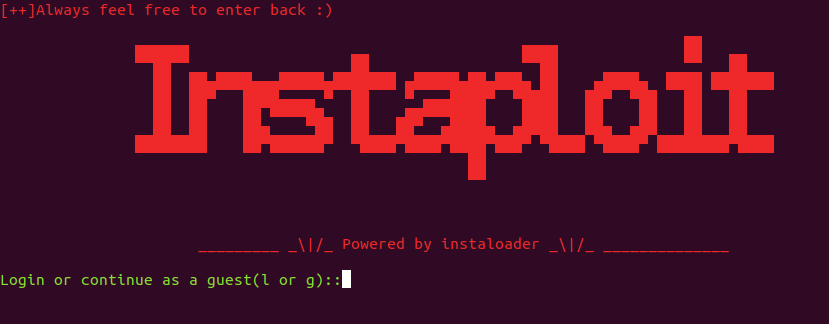
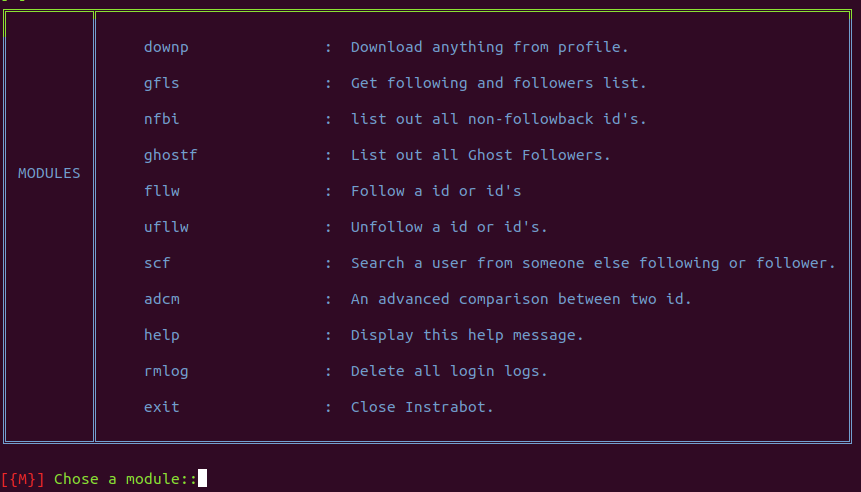

# Instaploit
---
## An advance tool for instargam

> Screenshot of instaploit:

## How to run it?

*Run `pip install -r requirement.txt or pip3 install -r requirement.txt`
* Than the instaploit.py file
* Make sure you system have install firefox
* On liunx run `sudo apt install firefox-geckodriver`

## Tested on Ubuntu 20.40 

Licensed under [MIT LICENSE](LICENSE)
